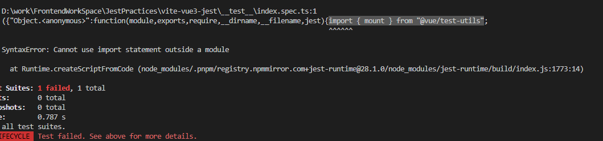

# Vue 3 + TypeScript + Vite

## Setup

1. pnpm create vite projectName
2. 查看 vite.config.ts 发现有报红
   - 安装 pnpm install @types/node --save-dev
3. 配置 alias (可选)

   ```ts tsconfig.json
   "compilerOptions" {
        "baseUrl": ".",
        "paths": {
            "@/*": ["src/*"]
        }
   }
   ```

   ```ts vite.config.ts
   import { defineConfig } from "vite";
   import vue from "@vitejs/plugin-vue";
   // node.js 不是内置对象的一部分，如果想用ts写node.js,需要引入@types/node
   const path = require("path");

   export default defineConfig({
     plugins: [vue()],
     resolve: {
       alias: {
         "@": path.resolve(__dirname, "src"),
       },
     },
   });
   ```

4.安装 jest 和声明文件

- 解决 Cannot find name 'test'. Do you need to install type definitions for a test runner? Try `npm i --save-dev @types/jest` or `npm i --save-dev @types/mocha`.ts(2582)
- pnpm install -D jest @types/jest
- 配置 tsconfig.json

  ```ts tsconfig.json
  includes: ["__test__/**.ts"];
  ```

5. 解决某些库不支持 isolatedModules：true

- 'index.spec.ts' cannot be compiled under '--isolatedModules' because it is considered a global script file. Add an import, export, or an empty 'export {}' statement to make it a module.
- 设置成 false

6. 安装 vue Test utils

- pnpm add -D @vue/test-utils@next
- 此时报错  
  
- 解决方法:

  - pnpm jest --init 选择 jsdom 的 web 测试环境
  - pnpm install -D jest-environment-jsdom 安装 jest 所需的 jsdom 环境
  - pnpm add -D ts-jest 安装 ts-jest

  ```ts 配置jest.config.ts
  export default {
    ...
    preset: "ts-jest",
    testEnvironment: "jsdom",
    transform: {
      "^.+\\.ts$": "ts-jest"
    }
    ...其他配置省略
  }
  ```
